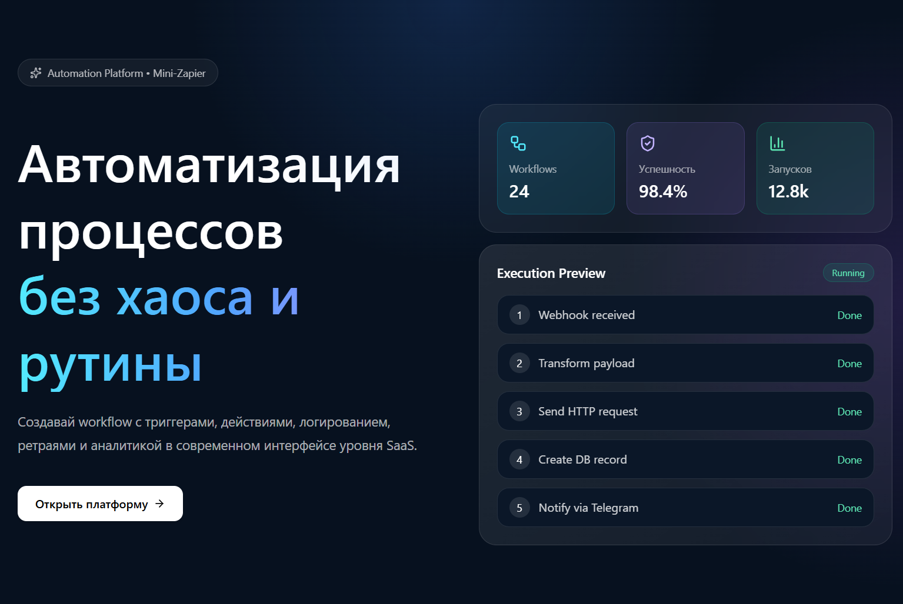
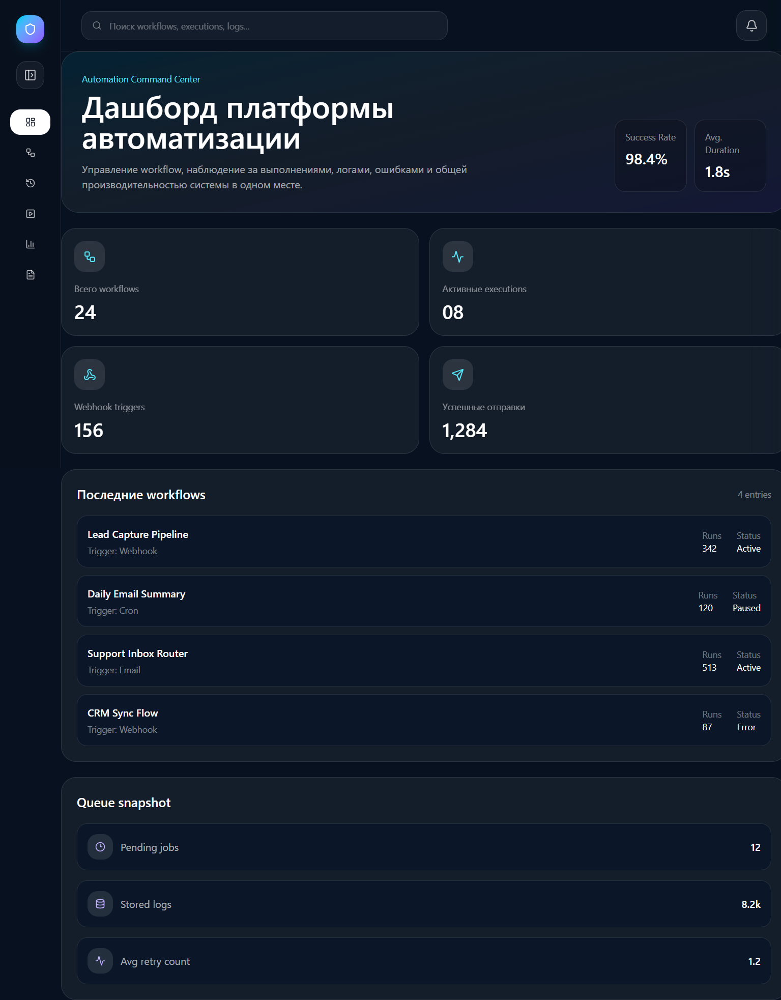
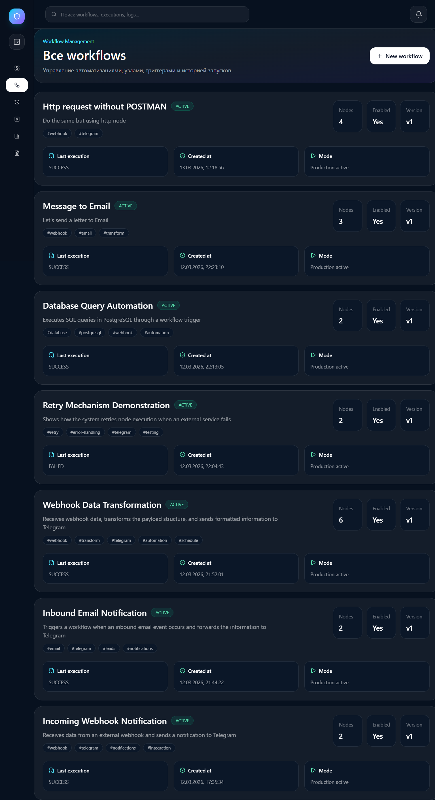
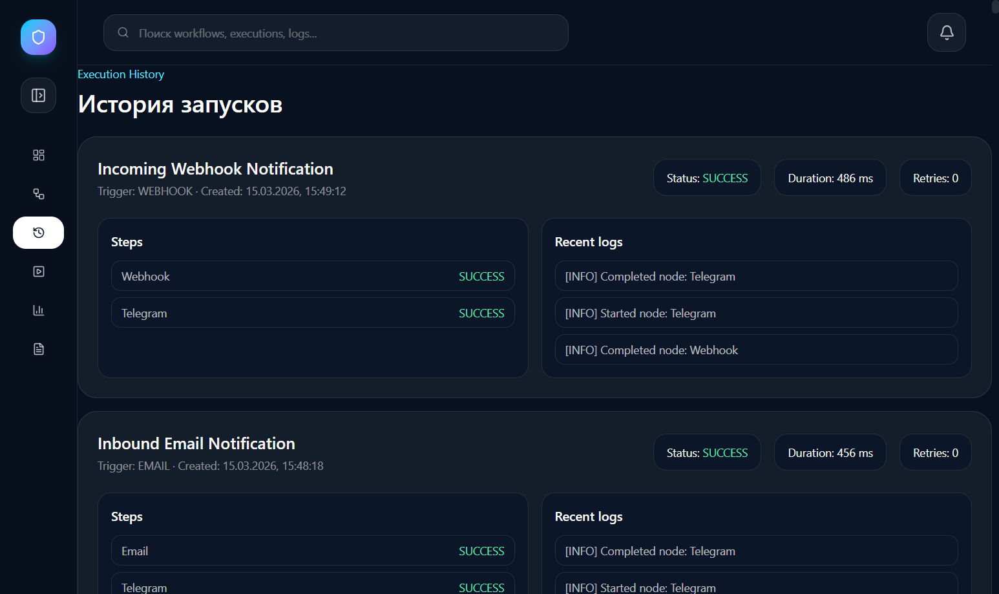
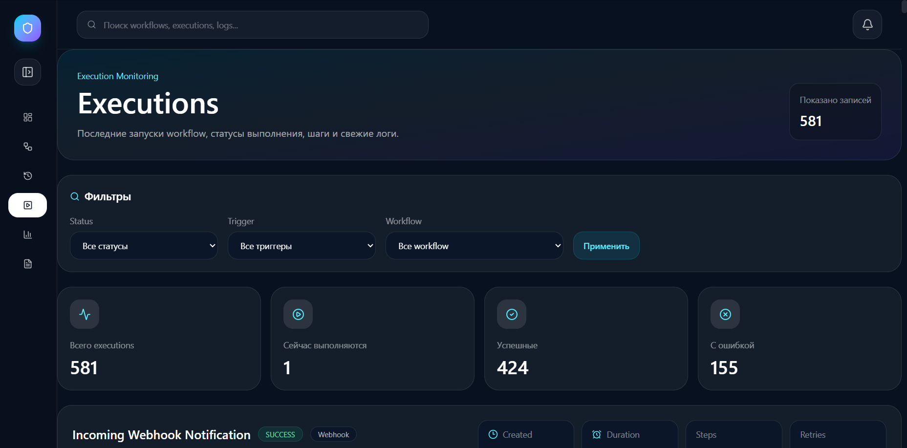
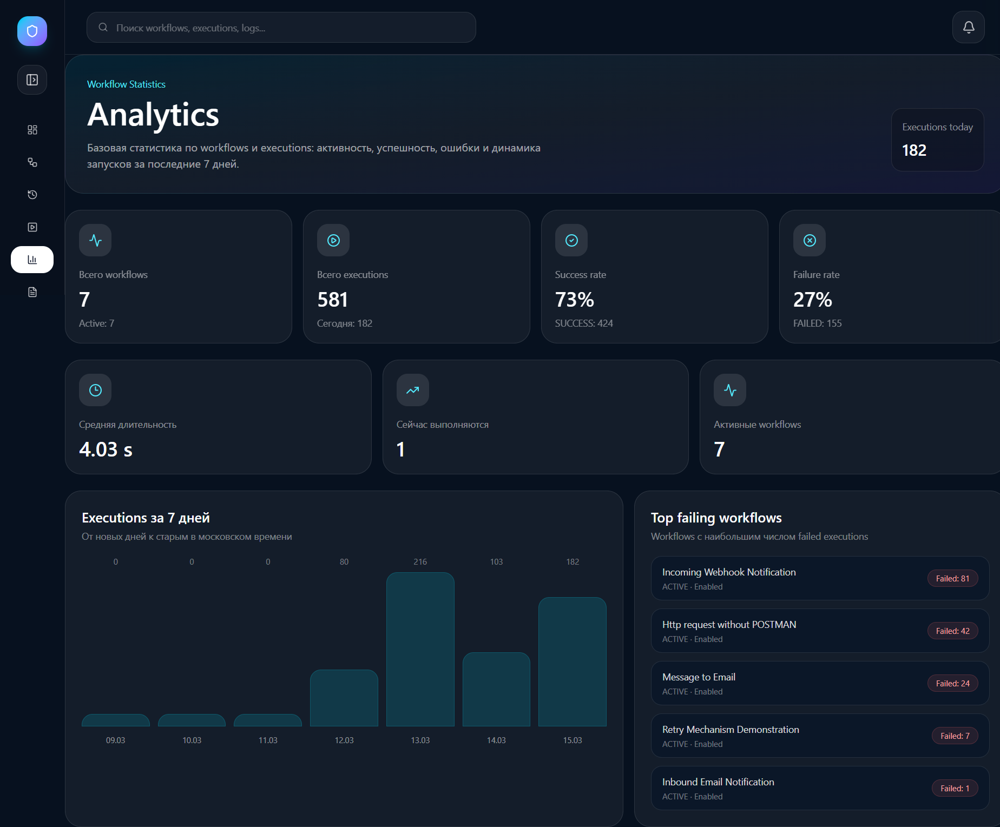
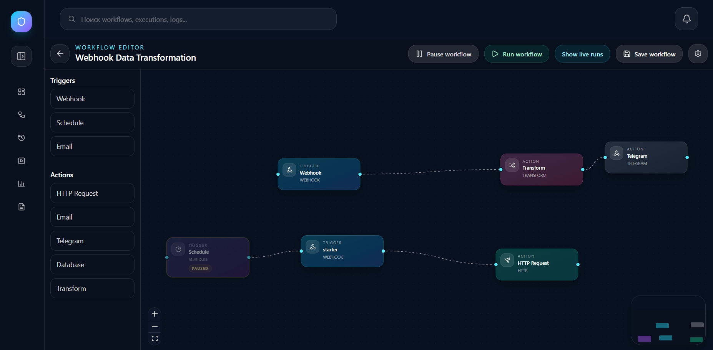

# Mini-Zapier

Mini-Zapier — это платформа автоматизации workflow, вдохновленная Zapier и n8n.

Проект позволяет создавать автоматические сценарии (workflow) между различными сервисами через визуальный редактор.

Workflow состоит из **узлов (nodes)**, соединенных между собой:

```
Trigger → Action → Action → ...
```

Поддерживаются:

- Webhook triggers
- Email triggers
- Schedule triggers (cron)
- HTTP actions
- Email actions
- Telegram actions
- Transform nodes

---

# 🌐 Демо

Production:

https://mini-zapier-7nb3luoox-s7ikecats-projects.vercel.app/

---

# 🖼 Скриншоты

### Input



---

### Dashboard



---

### Workflows



---

### History



---

### Executions



---

### Analytics



---

### Workflow Editor



---

# 🏗 Архитектура проекта

Проект построен на serverless архитектуре.

## Frontend + API

Хостинг:

Vercel

Технологии:

- Next.js (App Router)
- React
- TypeScript
- TailwindCSS

---

## Background Processing

Worker процессы выполняют workflow в фоне.

Хостинг:

Railway

Используется для:

- Workflow workers
- Scheduler (cron jobs)
- Queue processing

---

## Queue System

Для обработки задач используется очередь:

BullMQ

Redis хостится на:

Upstash

Используется для:

- workflow execution queue
- job retry
- background processing

---

## Database

База данных:

PostgreSQL

Хостинг:

Neon

ORM:

Prisma

Используется для хранения:

- workflows
- nodes
- executions
- execution logs
- notifications
- integrations

---

## Email

Отправка email происходит через:

Resend

https://resend.com

Используется для:

- email actions
- inbound email trigger

---

# ⚙️ Технологический стек

## Frontend

- Next.js
- React
- TypeScript
- TailwindCSS

## Backend

- Next.js API Routes
- Prisma ORM
- BullMQ

## Infrastructure

- Vercel — frontend + API
- Railway — workers и scheduler
- Neon — PostgreSQL
- Upstash — Redis
- Resend — Email

---

# 🧠 Как работает Workflow Engine

Workflow состоит из узлов:

```
Trigger → Action → Action
```

### Trigger nodes

- Webhook
- Email
- Schedule

### Action nodes

- HTTP Request
- Email
- Telegram
- Transform

---

# 🔁 Execution Flow

```
Trigger
   ↓
API
   ↓
Queue (BullMQ)
   ↓
Worker (Railway)
   ↓
Workflow Engine
   ↓
Node Execution
   ↓
Next Node
```

---

# 📡 Webhook Trigger

Каждый workflow может иметь webhook endpoint.

Пример:

```
POST /api/hooks/[path]
```

Webhook отправляет payload, который запускает workflow.

---

# 📧 Email Trigger

Входящие email могут запускать workflow.

Endpoint:

```
POST /api/inbound/email
```

Email принимается через Resend и превращается в workflow execution.

---

# 🔁 Schedule Trigger

Schedule trigger использует cron выражения.

Пример:

```
* * * * *
```

Запуск workflow каждую минуту.

Scheduler работает через Railway worker.

---

# 📦 Структура проекта

```
src
 ├── app
 │   ├── api
 │   │   ├── workflows
 │   │   ├── hooks
 │   │   ├── inbound
 │   │   └── executions
 │   └── (dashboard)
 │       ├── dashboard
 │       ├── workflows
 │       ├── analytics
 │       ├── executions
 │       └── history
 │
 ├── features
 │   ├── workflow
 │   └── workflow-editor
 │
 ├── server
 │   ├── services
 │   ├── queues
 │   ├── schedulers
 │   └── workers
 │
 ├── shared
 │   ├── types
 │   └── lib
 │
 └── widgets
```

---

# 🧪 Локальная разработка

### Установить зависимости

```
npm install
```

### Сгенерировать Prisma client

```
npx prisma generate
```

### Запустить dev сервер

```
npm run dev
```

---

# 🗄 Настройка базы данных

Используется PostgreSQL на Neon.

ENV:

```
DATABASE_URL=
```

После изменения Prisma схемы:

```
npx prisma migrate dev
```

---

# 🔴 Redis (Upstash)

ENV:

```
REDIS_URL=
REDIS_TOKEN=
```

Используется для BullMQ queue.

---

# 📧 Email (Resend)

ENV:

```
RESEND_API_KEY=
```

---

# 🚀 Deployment

Frontend и API:

Vercel

Background workers:

Railway

Database:

Neon

Queue:

Upstash

Email:

Resend

---

# 🔐 Безопасность

В текущей версии:

- нет системы авторизации
- нет пользовательских аккаунтов

Проект используется как демонстрационный прототип.

---
